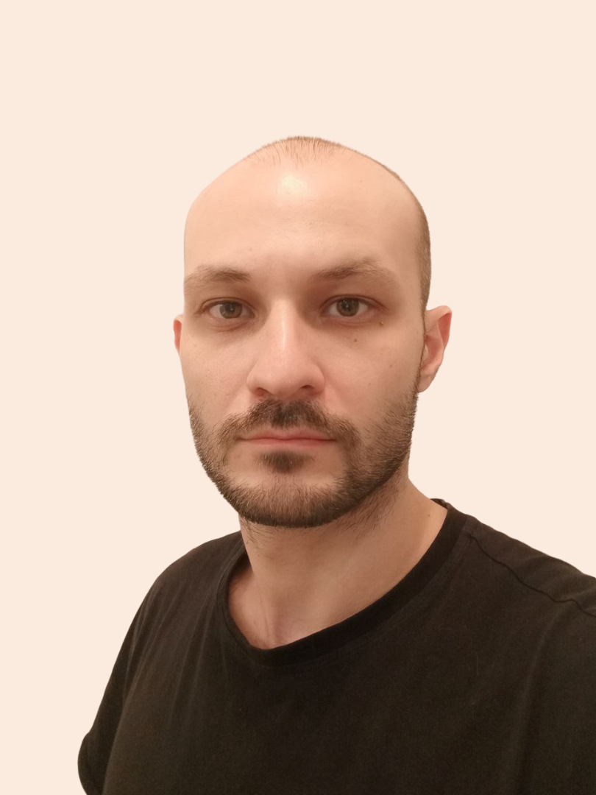
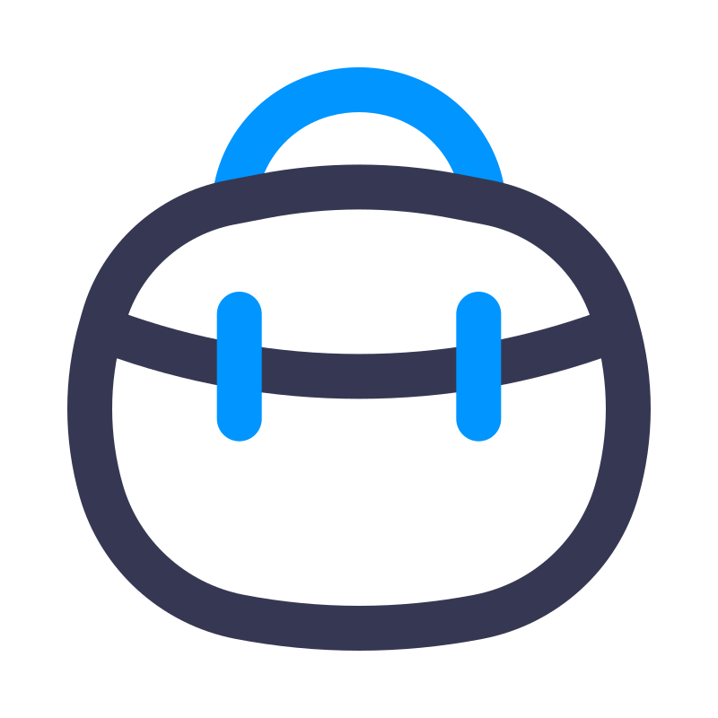
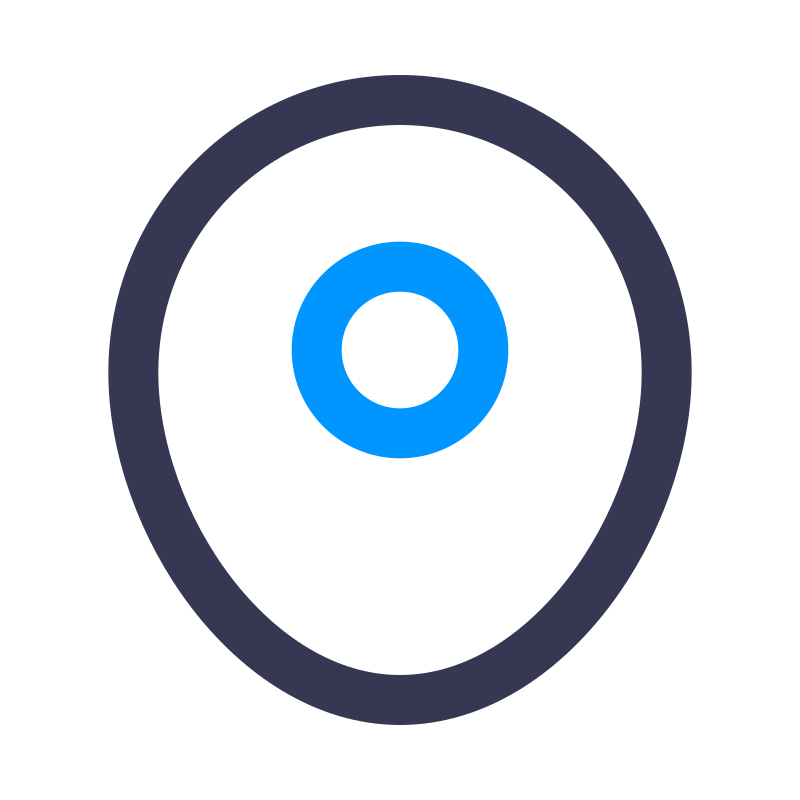

  <!-- About -->
  

  

    <h2>Владимир Богуславский</h2>
    <ul><h4>Менеджер с техническим уклоном</h4></ul>
  

  

    
  

       
  <h4>О себе:</h4>
  <ul>
    Считаю своим основным направлением менеджмент, но за время работы близко работал и с технической стороной.
 
Задаю вопрос "Почему наш процесс работы именно такой?" и ищу ответы, чем убираю лишние / "исторически сложившиеся" шаги.
 
Всегда ищу способы автоматизировать процессы в работе и не только.
  
  Как и в увлечения, я глубоко погружаюсь в рабочие задачи, мне нравится разбираться в том, чем занимаюсь.
  </ul>
   
  <!-- Work experience -->
  

  <h3 style="display: inline;">Опыт работы</h3>
  

   
  <h4 class="h_cv">
    
    Мобильный релиз-менеджер
  </h4>
   
  <small class="h_cv">
    
    Фогейм, Апрель 2025 - Настоящее время
  </small>
    
  <ul>
    Помощь компании в перенятии мобильных проектов от других команд / компаний, запуск новых мобильных проектов, работа с маркетплейсами, создание инструментов для автоматизации работы проектных команд и QA с мобильными проектами.
  </ul>
   
 
  <h4 class="h_cv">
    
    Менеджер проекта / Разработчик
  </h4>
   
  <small class="h_cv">
    
    Иннова, Июль 2017 - Апрель 2025
  </small>
    
  <ul>
    Работа с ММО проектами, создание ивентов, патчей, устранение
багов, создание инструментов для работы с игрой.
    Релиз-менеджмент на своём проекте, обучение и помощь QA.
  </ul>
   
 
  <h4 class="h_cv">
    
    Менеджер проекта
  </h4>
   
  <small class="h_cv">
    
    Иннова, Июнь 2016 - Июль 2017
  </small>
    
  <ul>
    Управление командой ММО проекта, создание и настройка
командных процессов, работа с другими отделами в компании.
  </ul>
   
 
  <h4 class="h_cv">
    
    Специалист службы поддержки
  </h4>
   
  <small class="h_cv">
    
    Иннова, Ноя 2015 - Июнь 2016
  </small>
    
  <ul>
    Первое знакомство с игровой индустрией, в начале только отвечал
пользователям, но довольно скоро начал заниматься организацией
работы в команде после ухода менеджера проекта.
  </ul>
   
 
  <h4 class="h_cv">
    
    Менеджер по инновационной работе
  </h4>
   
  <small class="h_cv">
    
    Региональный Бизнес Катализатор ДГТУ, Сен 2013 - Июн 2014
  </small>
    
  <ul>
    Создание сайта для компании, поиск и интервьюирование
инноваторов, создание и поддержание БД с их данными.
  </ul>
   
 
  <h4 class="h_cv">
    
    Стажёр
  </h4>
   
  <small class="h_cv">
    
    Cleanrooms Australia & PaullsAir, Янв 2013 - Июль 2013
  </small>
    
  <ul>
    Работа по привлечению клиентов, исследование конкурентов и рынка,
разработка сайтов, оптимизация SEO на сайтах компании.
  </ul>
  <!-- Education -->
  

   
  <h3 style="display: inline;">Образование</h3>
  

   
  <h4 class="h_cv">
    
    Master of International Business
  </h4>
   
  <small class="h_cv">
    
    Schiller International University, Madrid Campus, 2010 - 2012
  </small>
    
  <ul>
    Описание обучения
  </ul>
   
 
  <h4 class="h_cv">
    
    Магистр техники и технологий
  </h4>
   
  <small class="h_cv">
    
    ДГТУ, 2010 - 2012
  </small>
    
  <ul>
    Описание обучения
  </ul>
   
 
  <h4 class="h_cv">
    
    Специалист по Мировой экономике
  </h4>
   
  <small class="h_cv">
    
    ДГТУ, 2007 - 2011
  </small>
    
  <ul>
    Описание обучения
  </ul>
   
 
  <h4 class="h_cv">
    
    Бакалавр Мировой экономики
  </h4>
   
  <small class="h_cv">
    
    ДГТУ, 2007 - 2010
  </small>
    
  <ul>
    Описание обучения
  </ul>

  <h4>Контакты:</h4>
   (***) *** ** **
   
   vovsan@gmail.com
   
   
  

   
  <h4>Содержание:</h4>
  
  <a href="#about">Про меня</a>
   
  
  <a href="#work">Про работу</a>
   
  
  <a href="#education">Про образование</a>
   
   
  

   
  <h4>Курсы:</h4>
  <small>
    
    <a href="https://www.credential.net/8231b7b0-2a75-4b02-8cbe-a56d5138437c#acc.nP2R9VX5">Google Play Academy - Store Listing</a>
  </small>
   
  <small>
    
    <a href="https://certification-ads.apple.com/certificate/rg9AyN7Ozg">Apple Ads    Certification for ads on the App Store</a>
  </small>
   
  <small>
    
    Практикум: DevOps-инженер
  </small>
   
  <small>
    
    Сертификат по IT-Менеджменту CompTIA
  </small>
   
  <small>
    
    C# Programming for Unity Game Development Specialization
  </small>
   
  <small>
    
    Deep Learning Specialization
  </small>
   
   
  

   
  <h4>Языки:</h4>
  
  Русский
   
  
  English
   
  
  Español
   

